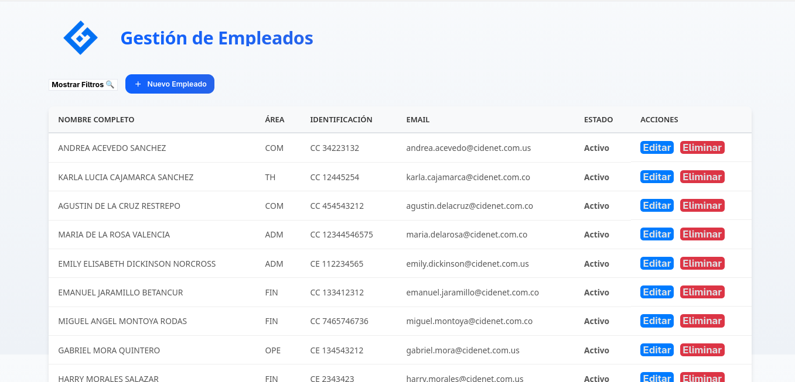

# cidenet

## 📌 Resumen
Pequeña app Django (DRF) + React para gestionar empleados (API REST en backend y SPA en frontend).

## 🚀 Requisitos previos
- Python 3.10+ (recomendado)
- Node.js 16/18+ (necesario para ejecutar/build del frontend React) y npm
- git

---

## 🧭 Configuración y ejecución (desarrollo)
Sigue estos pasos en dos terminales (backend y frontend):

### Backend (Django)
1. Abrir carpeta del proyecto y crear entorno virtual.

Linux / macOS (bash/zsh):
   - cd backend
   - python -m venv .venv
   - source .venv/bin/activate

Windows (cmd.exe):
   - cd backend
   - python -m venv .venv
   - .\.venv\Scripts\activate

Windows (PowerShell):
   - cd backend
   - python -m venv .venv
   - .\.venv\Scripts\Activate.ps1

2. Instalar dependencias:
   - pip install -r requirements.txt
3. Migraciones y usuario admin (opcional):
   - python manage.py migrate
   - python manage.py createsuperuser
4. Ejecutar servidor de desarrollo:
   - python manage.py runserver

Notas: si usas WSL puedes seguir los comandos de Linux/macOS dentro del subsistema.

Notas:
- API base: http://127.0.0.1:8000/api/
- Documentación OpenAPI/Swagger: http://127.0.0.1:8000/api/docs/
- Autenticación JWT: endpoints en `/api/token/` y `/api/token/refresh/`

### Frontend (React)
1. Abrir otra terminal y moverse al directorio del frontend.

Linux / macOS (bash/zsh):
   - cd frontend
   - npm install
   - npm start

Windows (cmd.exe / PowerShell):
   - cd frontend
   - npm install
   - npm start

2. La aplicación estará en: http://localhost:3000

Si cambias el puerto del backend, actualiza la URL en `frontend/src/services/api.js` o usa una variable de entorno. En Windows, si tienes problemas con permisos, usa PowerShell o WSL.

---

## 🧪 Tests
- Backend: `python manage.py test`
- Frontend: `npm test` (si corresponde, según configuración)

---

## 💾 Base de datos
- Por defecto usa SQLite (`backend/db.sqlite3`). Para producción, configura otro motor (Postgres, MySQL) y ajusta `backend/backend/settings.py`.

---

## 📄 Paginación
- La paginación por defecto está configurada en backend: `backend/employees/pagination.py` con `page_size = 10`.
- En el frontend hay paginación cliente-lado implementada para mostrar 10 empleados por página.

---

## ✅ Comprobaciones rápidas después de levantar la app
- Backend: abrir `http://127.0.0.1:8000/api/docs/` — debe mostrar la API.
- Frontend: abrir `http://localhost:3000` — debe verse la lista de empleados y poder crear/editar/eliminar.

---